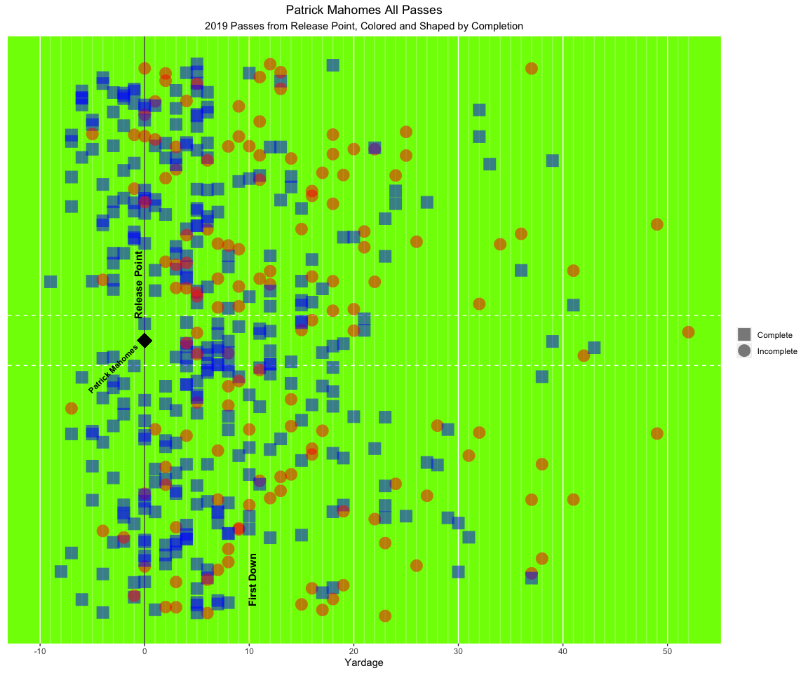

### Question:

For the 2019 regular season, what was the average depth of target and
location of Kansas City Chiefs QB Patrick Mahomes receivers (includes
WR, RB, TE)?

<!-- -->

### Caption:

Average Depth of target and location on the field of each of the 15 pass
catchers Patrick Mahomes threw too in 2019.

### Summary:

The data comes from an R package “nflscrapR”, it scrapes
pro-football-reference.com for statistics. It pulls the data at a play
level, the pull has 256 columns, I scraped aevery single Kansas City
Chief play for 2019, it ended up being 2807 plays. I narrowed this down
to just plays where Mahomes passed the ball, and elimated sacks. Then i
did some aggregation on his recievers to find the average depth of
target and the location they were targeted the most. Once I cleaned the
data I used ggplot2 to show where each recievers average depth of target
is and the location on the field, from Patrick Mahomes release point.
The players are differentiated by shape. I also included a first down
marker to show that he targets all his receivers further than a first
down (10 yards).

And because I love ggplot and have a bunch of experience in it, I made
another plot. I was interested in seeing all of Mahomes targets for
2019, and whether they were complete or imcomplete, i was curious about
this after making the graph above. Since I had most of the data curated
already and the base plot figured out, it just took some tweaking to
make this graph. I think both graphs show some tendicies that Mahomes
like to throw to his left, and medium distance. He does have some
targets he likes to consistenly go deep too and dump off short passes to
his running backs.

<!-- -->
